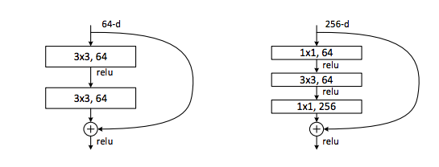
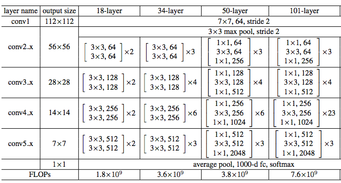
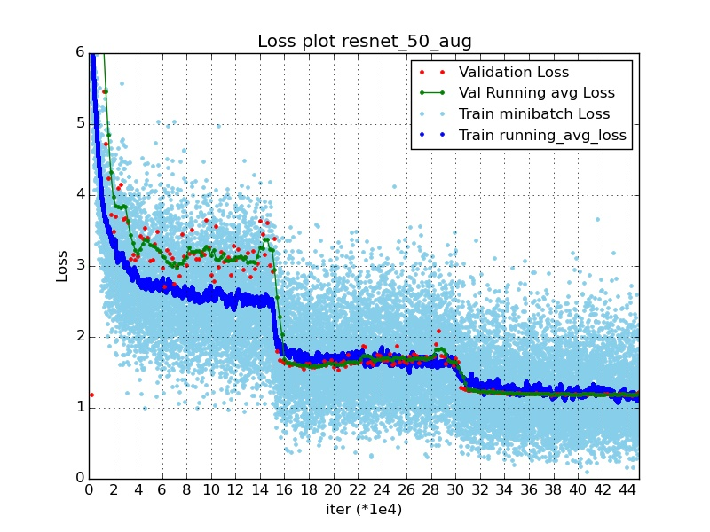

#### Creating residual networks
Here, we will demonstrate how to use pynetbuilder to generate residual networks (or its variants) as described in the residual networks [paper](https://arxiv.org/pdf/1512.03385v1.pdf). If you are not familiar with the residual networks, we suggest going through the paper before going through below tutorial. Please refer to this [doc](../../README.md) for more details on the design and idea of pynetbuilder.
 
 To summarize, a residual network usually consist of repeated blocks of convnet layers which typically have:
  * ***Main branch*** This is core building block for data transformation in the residual network. Example- 2 layers of 3x3 convolution (see figure below). We also provide a few tweaks to main branch besides ones implemented in paper. Currently following options are provided:
    * Normal -  2 layers of 3x3 (see left block in figure below)
    * Bottleneck -  3 layers: C1x1 (n/4) | C3x3 (n/4) | C1x1 (n) | (see right block in figure below)
    * 1-D convolution / Inception trick : 4 layers, such that each 3x3 in normal is converted to 1x3 and 3x1
    * Bottleneck + 1-D Conv / inception trick: 4 layers such that C3x3 in bottleneck is converted to 1x3 and 3x1. 
  * ***Shortcut*** - This is the parallel branch as shown in figure below. We provide identity or projection shortcut options (use projection while downsampling).

This structure is captured by the [ShortcutLego](../../netbuilder/lego/hybrid.py).

  
 

Given this shortcut based hybrid lego, build-resnet app provides easy way to stitch together residual networks. For example, following figure from resnet [paper](https://arxiv.org/pdf/1512.03385v1.pdf) describes some of the residual networks. Note that each stage consist of repeated blocks which are modelled by the shortcut Lego. 

 
 
 Example, 50 layer residual network can be generated as:
 ```
python app/imagenet/build_resnet.py -m bottleneck -b 3 4 6 3 -n 256 --no-fc_layers -o ./
 
Output:
Number of params:  25.556032  Million
Number of flops:  3858.026368  Million
 ```
 ```
usage: build_resnet.py [-h] -m MAIN_BRANCH [-n NUM_OUTPUT_STAGE1]
                       [-o OUTPUT_FOLDER] [-b BLOCKS [BLOCKS ...]]
                       [--fc_layers] [--no-fc_layers]

optional arguments:
  -h, --help            show this help message and exit
  -m MAIN_BRANCH, --main_branch MAIN_BRANCH
                        normal, bottleneck, inception_trick, inception_trick_bottleneck
  -n NUM_OUTPUT_STAGE1, --num_output_stage1 NUM_OUTPUT_STAGE1
                        Number of filters in stage 1 of resnet
  -o OUTPUT_FOLDER, --output_folder OUTPUT_FOLDER
                        Train and Test prototxt will be generated as
                        train.prototxt and test.prototxt
  -b BLOCKS [BLOCKS ...], --blocks BLOCKS [BLOCKS ...]
                        Number of Blocks in the 4 resnet stages
  --fc_layers
  --no-fc_layers


```


### Results with few tweaks to the residual networks
Below we show results with a few tweaks to residual networks, and discuss the tradeoffs of # parameters in network (which affects the model size or memory requirements) and number of connections / flops which affects the runtime of the model.

We use [caffe on spark](https://github.com/yahoo/CaffeOnSpark) which is a wonderful framework for distributed learning that brings deep learning to Hadoop and Spark clusters for training models for our experiments. Big thanks to to the caffe on spark team!

##### Major difference in training methodology
There are a few differences in our training as compared to the original paper, which may explain the lesser accuracy numbers, also read [disclaimer](https://github.com/KaimingHe/deep-residual-networks#disclaimer-and-known-issues) by Kaiming He.
 * We do not use color augmentation
 * We do not shuffling after each epoch
 * We use scale augmentation using implementation [here](https://git.corp.yahoo.com/fzliu/caffe-public/blob/yahoo/src/caffe/data_transformer.cpp), thanks a ton, Frank Liu!
 * We use 16 batch size per GPU and 16 GPUs (256 overall minibatch size) for faster training.
 * Different [caffe](https://github.com/yahoo/caffe/tree/e107fb7a0d737868aff401ef954c1d8059e5e450) version, bundled with caffe on spark

The training strategy is very similar to what is used in paper. It took ~5 days to train the resnet-50 model using caffe on spark.

***Note***: The accuracy is the top-1 center crop accuracy on imagenet validation dataset.

##### Basic residual network results
| Model | Accuracy | #Flops | #Params | Description| |
|---:|---:|---:|---:|---:|---:|
|Resnet 50|0.7175|3858.02|25.55| Original resnet 50 as in paper|[Download](https://www.dropbox.com/s/k382wr2bzi59m4c/resnet_50.caffemodel?dl=0)|
|Resnet 50 1by2|0.6679|1069.59|6.92| Similar to resnet 50 blocks:[3,4,6,3] all layers have half filters except conv1|[Download](https://www.dropbox.com/s/2ojd4mwzwset9qo/resnet_50_1by2.caffemodel?dl=0)|
|resnet 77 1by2|69.84|1560.93|9.44| blocks:[3,4,15,3] with half filters|[Download](https://www.dropbox.com/sh/r5jg3wsdgap7ulg/AAB5yHpTGAt8Thod0Rd0T000a?dl=0)|

##### Plots
 * Following plot shows the training loss and center crop top 1 validation loss vs iterations. (Please refer to the model folders for plots for specific models). Note that there is slight overfitting when LR is 0.01 (between iters 150k to 300k). If scale augmentation is not used, the overfitting is sharper, and the performance degrades.
 

##### Models with inception trick
In below experiments we replace 3x3 with 3x1 and 1x3 convs as suggested in [inception V2 paper](https://arxiv.org/pdf/1512.00567v3.pdf).
This helps to save a few computations, without too much impact on performance. Below table compares resnet_50_1by2 and its counterparts resnet_66_1by2_inception_trick with and without FC stage.
The Fully connected stage we use is a combination of 2048 1by1 Conv + Avg pool + 4096 1by1 Conv. This gives a good boost in accuracy as described in below experiments. 

| Model | Accuracy | #Flops | #Params | Description|
|---:|---:|---:|---:|---:|
|Resnet 50 1by2|0.6679|1069.59|6.92| Similar to resnet 50 in paper, blocks:[3,4,6,3] all layers have half filters except conv1|
|Resnet 66 1by2 inception trick and bottleneck|0.6636|915.46|5.98| Same as resnet 501by2, 3x3 conv replaced by 3x1 and 1x3. blocks: [3,4,6,3] |
|resnet 68 1by2 with4k inception trick and bottleneck|0.6963|1029.69|19.55| Same as above, added 2 FC layers (2048 and 4096)|


##### Smaller model with good performance
We can distribute parameters over network in different ways. Using below architecture where we add FC layer as described above after the residual network stages we achieve 70.76% top 1 center crop accuracy, and has compute time less than GoogleNet (only using scale augmentation and training disclaimers mentioned above) 

| Model | Accuracy | #Flops | #Params | Description||
|---:|---:|---:|---:|---:|---:|
|resnet 34 inception trick|0.678|1370.93|8.55| Similar to resnet 18 in paper blocks:[2,2,2,2], 3x3 blocks replaced with inception trick, so 1 block has 4 layers||
|resnet 36 with4k inception trick|0.7076|1434.30|21.58| Similar to resnet 18 in paper, 3x3 blocks replaced with inception trick, added FC stage as described above|[Download](https://www.dropbox.com/s/79d3w6ylnqbzz3o/resnet_36_with4k_inceptiontrick.caffemodel?dl=0)|

 
 
