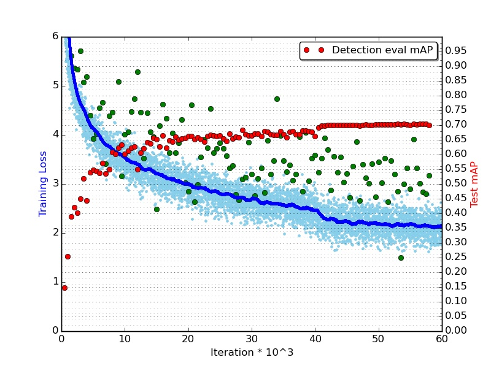

#### Creating object detection network using SSD

[SSD](http://arxiv.org/abs/1512.02325) is a wonderful unified framework for object detection with a single network proposed by [Wei Liu](http://www.cs.unc.edu/~wliu/) et al. Please refer their paper for more details. Code is also provided to reproduce the results in paper. We reuse a lot of their network generation code and modify it in the Lego framework. 

In summary SSD uses a pretrained network and attaches 'detection heads' to multiple feature maps (outputs of different layers), in order to learn detectors at different scales. 
Every detection head has three branches (collection of caffe layers):
 * Priorbox: It maps the groundtruth bboxes to candidate priorboxes at different aspect ratios.
 * Confidence prediction layers: It consist of 3x3 conv filters for predicting object detection scores for each class
 * Location prediction layers: It consist of 3x3 conv layers for bounding box location prediction.

The [ssdlego](../../netbuilder/lego/ssd.py) provides easy way to attach detection head to standard networks. Ideas and code for SSD lego generation is borrowed from [here](https://github.com/weiliu89/caffe/tree/ssd), the ssdlego abstracts out a few functionalities in order to preserve the object oriented Lego paradigm. We provide code to build VGG and residual network detection networks as described below, contributions to build other detection networks are welcome!

#### Using build_ssdnet app
build_ssdnet.py app can be used to generate end-2-end detection networks. Currently, VGG and residual network based detection networks can be generated.

```
usage: create_ssdnet.py [-h] [-t TYPE] [-o OUTPUT_FOLDER]
                        [-n NUM_OUTPUT_STAGE1]
                        [--mbox_source_layers MBOX_SOURCE_LAYERS [MBOX_SOURCE_LAYERS ...]]
                        [-b BLOCKS [BLOCKS ...]]
                        [--extra_blocks EXTRA_BLOCKS [EXTRA_BLOCKS ...]]
                        [--extra_num_outputs EXTRA_NUM_OUTPUTS [EXTRA_NUM_OUTPUTS ...]]
                        [--extra_layer_attach EXTRA_LAYER_ATTACH]
                        [--fc_layers] [--no-fc_layers] -m MAIN_BRANCH

This script generates ssd vggnet train_val.prototxt files

optional arguments:
  -h, --help            show this help message and exit
  -t TYPE, --type TYPE  Resnet or VGGnet
  -o OUTPUT_FOLDER, --output_folder OUTPUT_FOLDER
                        Train and Test prototxt will be generated as
                        train.prototxt and test.prototxt
  -n NUM_OUTPUT_STAGE1, --num_output_stage1 NUM_OUTPUT_STAGE1
                        Number of filters in stage 1 of resnet
  --mbox_source_layers MBOX_SOURCE_LAYERS [MBOX_SOURCE_LAYERS ...]
                        Names of layers where detection heads will be attached
  -b BLOCKS [BLOCKS ...], --blocks BLOCKS [BLOCKS ...]
                        Number of Blocks in the 4 resnet stages
  --extra_blocks EXTRA_BLOCKS [EXTRA_BLOCKS ...]
                        Number of extra Blocks to be attached to Detection
                        network
  --extra_num_outputs EXTRA_NUM_OUTPUTS [EXTRA_NUM_OUTPUTS ...]
                        Number of outputs of extra blocks Detection network
  --extra_layer_attach EXTRA_LAYER_ATTACH
                        Name of layer where extra Blocks will be attached
  -c NUM_CLASSES, --num_classes NUM_CLASSES
                        Number of classes in detection dataset
  --fc_layers
  --no-fc_layers
  -m MAIN_BRANCH, --main_branch MAIN_BRANCH
                        normal, bottleneck
```

##### Residual networks based detection network

We will use the resnet_50 residual network architecture same as the one described in [residual networks paper](https://arxiv.org/abs/1512.03385) as the pretrained network. Please refer [this doc](../imagenet/Readme.md) for more details on how the network was trained.

Below table shows the layers to which we will attach the detection heads, we select feature maps similar to the ones described in the SSD paper, for VGG network.

| Layer | OutputFeatureMap size|Normalize?|Prior boxes|
|---:|---:|---:|---:|
|conv1|150x150| Not used||
|stage 0|75x75|Not used||
|stage 1|38x38|Yes|3|
|stage 2|19x19|Yes|6|
|stage 3|10x10|Yes|6|
|stage 4|5x5|No|6|
|stage 5|3x3|No|6|
|pool_last|1x1|No|6|

***Note***
 * We freeze conv1 and stage1 while finetuning parameters for detection.
 * stages 4 and 5 are again 3 blocks of shortcut based residual networks with 2048 filters each, downsampling is done at start of each block using projection shortcuts.
 * We set use_global_stats batch norm param for conv1 and stage1 to true, while training for detection.
 * It takes ~30-35 hours to train this network, on 4 GPUs batch size (8*4).

You can use following command to generate the detection network:
```
python app/ssd/create_ssdnet.py --type Resnet -n 256 -b 3 4 6 3 --no-fc_layers -m bottleneck --extra_blocks 3 3  --extra_num_outputs 2048 2048 --mbox_source_layers relu_stage1_block3 relu_stage2_block5 relu_stage3_block2 relu_stage4_block2 relu_stage5_block2  pool_last --extra_layer_attach pool -c 21 -o ./

Output:
...
...
Number of params:  71.471168  Million
Number of flops:  9178.433664  Million
```

This will generate the train and test prototxt files. For reference, please check the [resnet_50](./resnet_50) folder, which also contains the solver files. ***Note*** you would have to replace the data layer, refer the prototxt files in above folder. Also edit the data locations so it points your lmdb files.

We train 40k iters with LR 0.01 and 20k iters more with LR 0.001 and we get **70.4 mAP** after 60k iterations on voc2012. Following figure shows the loss and map plot:
 
 
#### Comparing VGG and Resnet 50 SSD based detection networks:
Below table shows the network statistics and mAP for VGG and resnet 50 detection networks for voc2007 dataset.

| Network |# Params (Million)|# Connections / Flops (Million)| Detection mAP|
|---:|---:|---:|---:|
|VGG (SSD paper)|26.06|31207.75|72.1|
|resnet_50|71.47|9178.43|70.4|

You can download the resnet 50 + ssd caffemodel [here](https://www.dropbox.com/s/en1niufn7nagh27/detect_snapshot_iter_60000.caffemodel?dl=0). 

#### Building other detection networks
You are welcome to use ssd legos for building your own SSD based detection networks. If you have your own architecture, you can build the network as follows:
 * Create a class in ```netbuilder.nets.imagenet``` which will return your core network.
 * Create a function in ```netbuilder.nets.ssdnet``` which will attach the detection heads to your core network.
 * Add functionality in create_ssdnet.py inside app folder, so it can return your SSD network.

Contributing detection network generation code to this repository is welcome, please submit PR and we will review it. 
 
